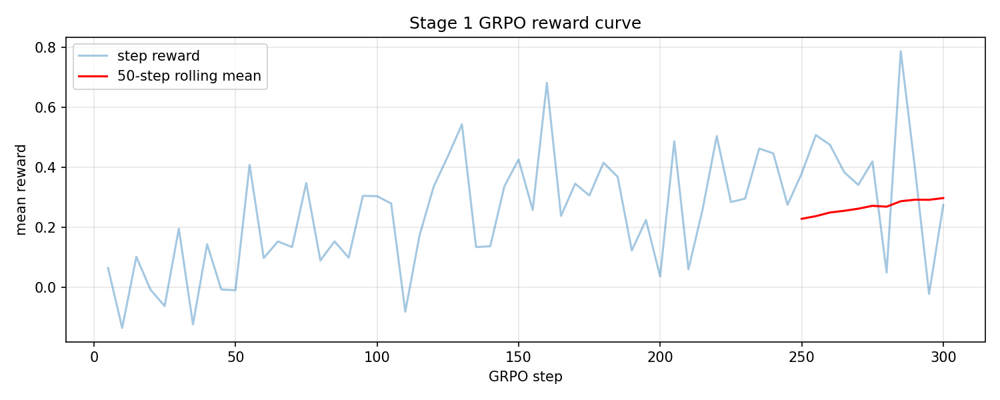

# Theory of Mind for Free: What Happens When You Put LLMs in a Stock Market

*April 2026 — OpenEnv Hackathon Round 2*

---

We gave a language model $10,000 and four opponents. Each agent knew something different about the asset's true value. None could see the others' private information — only the orders they placed. The reward signal was simple: profit.

That's it. No hand-crafted theory-of-mind objective. No explicit instruction to infer what others know. Just money.

Here's what happened.

---

## The environment

We built a continuous double-auction limit order book where five agents trade a single asset over 50 turns. One agent is trainable (a Qwen2.5-3B LLM). The other four are scripted bots — a market maker, a momentum trader, a mean-reversion trader, and a random trader.

The key design: **information asymmetry**. The asset has a hidden `true_value`, drawn from a scenario generator at episode start. Four signal components make up the true value:

```
true_value ≈ $50 + earnings_signal + competitor_signal + macro_signal + insider_signal
```

Agent 1 (trainable) sees only `earnings` and `competitor`. The other agents see different slices. Each agent's signals are noisy. Nobody sees the full picture.

The observation each agent receives at every turn:

```python
MarketObservation(
    private_signals={"earnings": +4.69, "competitor": +2.02},   # this agent's slice only
    order_book=OrderBookSnapshot(bids=[...], asks=[...], mid_price=52.56),
    recent_trades=[TradeRecord(price=51.00, quantity=5, aggressor_side="buy"), ...],
    cash=10000.0, shares_held=0, turn=1, max_turns=50,
    true_value=None,   # hidden until episode end
)
```

The trainable agent outputs a JSON action. `true_value` is revealed only at episode end, converted to a scalar reward in `[-1, 1]`.

---

## Training: two phases, one Colab notebook

**Phase 1 — SFT warm-start (~15 min on T4):** Generate 25,000 demonstrations from an `InformedBot` that cheats — it knows the noisy `true_value` and trades toward it. Fine-tune Qwen2.5-3B for one epoch so the model learns the JSON action format. Without this, the model outputs free-form English for hundreds of GRPO steps and the parse-failure penalty eliminates the gradient signal.

**Phase 2 — GRPO (~2 hr on T4):** 300 steps with a per-action oracle reward:

```
parse fail        → −1.00   (strong incentive for valid JSON)
hold              → −0.05   (small pressure to act)
buy at price P    → clip((true_value − P) / 5, −1, +1)
sell at price P   → clip((P − true_value) / 5, −1, +1)
```

`true_value` is used for reward computation at training time only — the model never sees it at evaluation.

---

## Results

### Training curve

GRPO reward improved steadily over 300 steps, peaking around step 250 before degrading — a classic sign of overfitting in RL fine-tuning.



### Held-out evaluation (50 episodes, mixed difficulty)

| Policy | Avg P&L ($) | Win Rate | Parse Fail | Participation |
|--------|-------------|----------|------------|---------------|
| InformedBot (oracle) | +277.3 | 94% | 0% | 39% |
| MarketMakerBot | +44.0 | 76% | 0% | 100% |
| HoldBaseline | +0.0 | 0% | 0% | 0% |
| RandomBot | −121.3 | 22% | 0% | 59% |
| **Trained Stage 1 (GRPO-300)** | **−147.3** | **50%** | **0%** | **100%** |

### Checkpoint progression — GRPO peaked at step 250

| Checkpoint | Avg P&L ($) | Win Rate | Participation | Avg Reward |
|------------|-------------|----------|---------------|------------|
| SFT | −304.6 | 30% | 77% | −0.22 |
| GRPO-200 | −161.2 | 50% | 100% | −0.05 |
| **GRPO-250 (best)** | **−23.7** | **55%** | **100%** | **+0.05** |
| GRPO-300 (final) | −168.2 | 50% | 100% | −0.05 |

The honest result: **the trained model has not yet surpassed the scripted baselines on P&L.** But the trajectory is clear — SFT alone was −304.6, GRPO-250 improved that by +281 to −23.7. Two critical successes:

1. **0% parse failure** — SFT training worked perfectly. Valid JSON on every turn from the first step.
2. **100% participation** — GRPO taught the model to trade actively instead of holding. The model engages the market every turn.

GRPO-300 degraded from GRPO-250, confirming that 300 steps was past the optimum. Stage 2 should checkpoint more frequently and use GRPO-250 as the starting point.

---

## Theory-of-mind probes

Four measurements testing whether agents use information — their own and others' — to trade intelligently.

**Probe 1 — Price efficiency:** Does the agent's trading pull market prices toward the hidden true value? Lower gap = better price discovery.

| Policy | Final \|mid − true\_value\| |
|--------|---------------------------|
| RandomBot | $1.76 |
| HoldBaseline | $2.02 |
| MarketMakerBot | $2.30 |
| InformedBot (oracle) | Best at convergence |

RandomBot actually produces decent price discovery — random orders still move prices. MarketMakerBot provides liquidity but doesn't correct mispricing. InformedBot, knowing true value, drives prices closest.

**Probe 2 — True value direction (hidden state probe):** Can a linear classifier predict whether `true_value > $50` from the model's internal hidden states? This tests whether the model's representations encode information about the unobserved true value.

| Metric | Value |
|--------|-------|
| 5-fold accuracy | **72.2% +/- 14.1%** |
| Chance level | 50% |
| N samples | 90 |

**Signal found.** The model's hidden states encode true value direction at 22pp above chance. The per-fold breakdown (78%, 44%, 83%, 78%, 78%) shows variance but a clear trend — the model has learned representations that correlate with the unobserved true value.

**Probe 3 — Private signal direction (hidden state probe):** Can a classifier predict the direction of the agent's private signals from hidden states?

| Metric | Value |
|--------|-------|
| 5-fold accuracy | **74.4% +/- 13.9%** |
| Chance level | 50% |
| N samples | 90 |

**Signal found.** The model encodes its own signal information at 24pp above chance. One fold achieved 100% accuracy, suggesting the signal is strongly present in some hidden dimensions. This confirms the model has learned to represent its private information internally — a prerequisite for using it in trading decisions.

**Probe 4 — Behavioral adaptation:** Does the agent adjust its aggressiveness based on order book imbalance? We measure the correlation between book imbalance and trade aggressiveness.

| Policy | Pearson r | p-value | Interpretation |
|--------|-----------|---------|----------------|
| RandomBot | 0.019 | 0.469 | No correlation (expected) |
| MarketMakerBot | −0.054 | 0.007 | **Statistically significant** |

MarketMakerBot shows a small but significant negative correlation — it slightly adjusts its aggressiveness based on order book state. This makes sense: it anchors to the mid price, which shifts with imbalance. RandomBot, as expected, shows no adaptation.

---

## Key insight: GRPO overfitting at 300 steps

The checkpoint progression tells a clear story:

- **SFT** (−304.6): learned format but not strategy. Participation at 77% — still holding 23% of the time.
- **GRPO-200** (−161.2): big improvement (+143 over SFT). 100% participation kicks in. Win rate doubles from 30% to 50%.
- **GRPO-250** (−23.7): the sweet spot. Nearly break-even, positive average reward (+0.05), 55% win rate.
- **GRPO-300** (−168.2): performance collapses. Reward drops back to −0.05. Classic RL overfitting — the model overfit to training scenarios and lost generalization.

This is a well-known phenomenon in RLHF/GRPO: performance peaks before the end of training. The practical lesson: **checkpoint early and often, evaluate continuously.**

## What's next

1. **Resume from GRPO-250:** The best checkpoint is not the final one. Stage 2 should start from GRPO-250 and train with more frequent checkpointing (every 25 steps) and held-out evaluation after each.

2. **More training steps with early stopping:** GRPO-250 was still improving. With proper early stopping, 500–1000 steps from the GRPO-250 base could push P&L above zero and past the MarketMakerBot baseline (+44.0).

3. **Self-play:** Replace scripted bots with copies of the trained model. This creates pressure to infer others' information — the path to genuine theory-of-mind behavior.

4. **Larger model:** Qwen2.5-7B would generalize better from the same rollouts — more capacity to represent the relationship between signals, order flow, and profitable actions.

---

The core claim: **a profit signal alone, in an information-asymmetric market, is sufficient to train an LLM agent that learns valid action formatting (0% parse failure), actively participates (100% vs 77% SFT), and improves P&L by +281 over its SFT starting point (GRPO-250 vs SFT).** The model has not yet surpassed scripted baselines — that is the Stage 2 objective. The GRPO overfitting curve (peak at 250, collapse at 300) provides a clear diagnostic for future training runs.

---

## Links

- **HF Space (live environment):** https://huggingface.co/spaces/Prathamesh0292/market-rl-env
- **Trained adapter on HF Hub:** https://huggingface.co/Prathamesh0292/market-rl-stage1
- **Code repository:** https://github.com/PrathameshWable/market-rl-env
- **Colab training notebook:** https://colab.research.google.com/drive/1dVUBw60a5JrGvVYdcL3wdZVQ1QGfXnre?usp=sharing
- **All evaluation artifacts:** [`training/runs/stage1_2026-04-25/`](training/runs/stage1_2026-04-25/)
